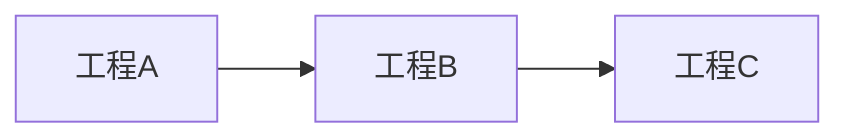
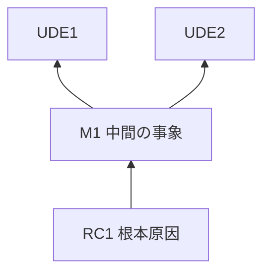
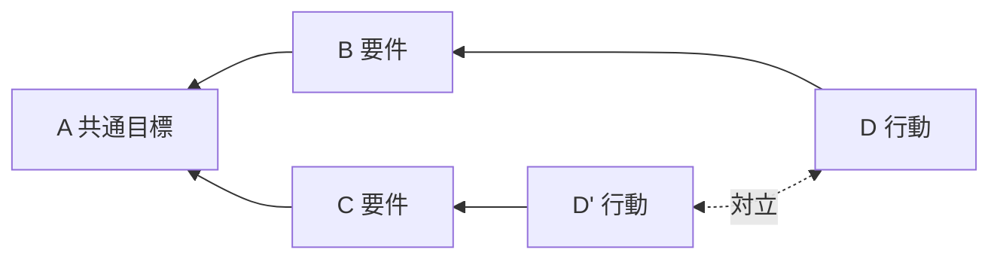
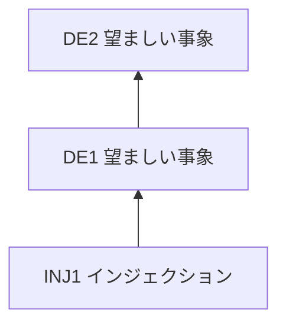
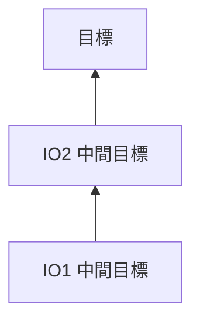

# 工程別成果物テンプレート

各工程の成果物ファイルは、該当テンプレート(コードフェンス内)をコピーして作成する。`合意ステータス` は draft → reviewed(独立レビュー完了)→ agreed(クライアント合意)と遷移させ、agreed になるまで次工程に進んではならない(巻き戻し時は agreed から draft に戻すことがある。詳細は SKILL.md の巻き戻しルール参照)。

【TP】は思考プロセスモード、【5FS】は5集中ステップモードでのみ記入する節。無印は両モード共通。

## 工程1 テンプレート(01-problem-structure.md)

````markdown
# 問題把握

合意ステータス: draft
モード: (TP / 5FS)
問題の性質: (線形 / 複雑 — 起動時の分類を記録。再開時はここから復元する)
TOC 適用の妥当性: (適する / 適さない — 「システム全体の成果が少数の制約に支配されているか」の判定と根拠を1〜2文で。TOC は正解を保証する理論ではなく焦点を絞るための発見的手法であり、適さない問題に強制適用しない。適さないと判断した場合は他アプローチへの切替を提案し、その旨をここに記録する)

## クライアントの要望(原文のまま)

## システムのゴール
(このシステム・組織・プロセスは何のために存在し、何が増えれば成功か。分析対象の範囲もここで宣言する)

## 【TP】UDE 一覧
(5〜10件目安。UDE=観測できる形で記述された「現に起きている困った事実」。「〜がない」等の解決策の裏返し表現は不可)

| ID | UDE(観測可能な事実として) | 出所(誰の観測・どのデータか) | 事実性チェック |
| --- | --- | --- | --- |
| UDE1 | | | 通過 / 要言い換え |

## 【5FS】評価指標の定義
(スループット=システムがお金・価値を生み出す速度/在庫・投資=売るために抱えているもの/業務費用=在庫をスループットに変えるための費用。案件の言葉で定義する)

## 【5FS】フロー図
(工程・滞留・在庫の流れを見える化する。ノード表と併記)



| ID | 工程 | 処理能力・所要時間 | 滞留・在庫の観測 |
| --- | --- | --- | --- |

## なぜクライアントにとって問題なのか

## 未確定事項とヒアリング記録
(未解消の曖昧さ、クライアントへの質問と回答の記録)
````

## 工程2 テンプレート(02-what-to-change.md)

````markdown
# 何を変えるか

合意ステータス: draft

## 前提(工程1で合意した内容の要約)

## 【TP】ルートの選択
(古典法 / 3クラウド法 — 選択理由を1〜2文で。使い分けは references/toc-guide.md 参照)

## 【TP】現状ツリー
(UDE から根本原因へ遡る因果の図。3クラウド法の場合は統合クラウドから構築した検証用ツリー)



| ID | 記述 | 種別(UDE / 中間 / 根本原因) | 検証状態(未検証 / 検証済み / 棄却) |
| --- | --- | --- | --- |

## 【TP】中核対立(または少数の根本原因)
(多くの UDE の根元にある、両立しない2つの行動要求。競合仮説がある場合は並置し反証条件を付す)

## 【TP】コア経路の CLR 検証記録
(根本原因〜中核対立の経路の各矢印について、どの CLR 観点で確認したか)

| 矢印(ID→ID) | 確認した CLR 観点 | 結果 |
| --- | --- | --- |

## 【5FS】制約候補と認定
(データ・観察に基づき認定する。印象・多数決による認定は禁止)

| 候補 | 根拠データ・観察事実 | 判定(制約 / 非制約) | 種別(物理制約 / 方針制約) |
| --- | --- | --- | --- |

## 【5FS】方針制約の場合の扱い
(制約が方針・ルール由来なら、思考プロセスモード(TP)への切替またはクラウド併用を提案した記録)

## 未確定事項とヒアリング記録
````

## 工程3 テンプレート(03-what-to-change-to.md)

````markdown
# 何に変えるかへ

合意ステータス: draft

## 前提(工程2で合意した中核対立・制約の要約)

## 【TP】クラウド(対立解消図)
(A=共通目標、B・C=要件、D・D'=対立する行動。3クラウド法で工程2に作図済みならここへ引き継ぐ)



## 【TP】前提の列挙とインジェクション
(各矢印の背後の「なぜならば」を列挙し、崩せる前提に対立自体を消す解決アイデアを導出する)

| 矢印 | 背後の前提 | 崩せるか | インジェクション(ID付き) |
| --- | --- | --- | --- |

## 【TP】未来ツリー
(インジェクションを起点に「〜ならば〜になる」を積み、各 UDE が望ましい事象に置き換わることを検証する)



| ID | 記述 | 種別(インジェクション / 望ましい事象) | 置き換える UDE |
| --- | --- | --- | --- |

## 【TP】ネガティブブランチと刈り込み
(インジェクションが引き起こしうる新たな悪影響の因果枝と、その対策)

| インジェクション | 懸念される悪影響 | 因果経路(要約) | 刈り込み策 |
| --- | --- | --- | --- |

## 【TP】コア経路の CLR 検証記録
(インジェクション〜主要な望ましい事象の経路の各矢印について)

| 矢印(ID→ID) | 確認した CLR 観点 | 結果 |
| --- | --- | --- |

## 【5FS】徹底活用の方策
(制約を1分も無駄にしない方策。制約の時間を奪っているものの除去・段取り改善・不良品を制約に流さない等)

## 【5FS】従属の方策
(制約のペースに全体を合わせる方策。制約前のバッファ=時間的余裕の置き方、投入の制御を含む)

## 【5FS】判定ゲート: 制約は解消済みか
(活用・従属で制約が解消見込みなら「強化はスキップ」と記録し、工程4へ。解消しない場合のみ次節を記入)

## 【5FS】強化(投資)の設計(必要な場合のみ)
(能力増強の選択肢と投資対効果)

## 未確定事項とヒアリング記録
````

## 工程4 テンプレート(04-requirements.md)

````markdown
# 要件定義

合意ステータス: draft

## 前提(工程3で合意したインジェクション・方策の要約)

## 作業と手順の定義
(各インジェクション・方策を実装可能な作業に具体化する)

## 成果物の定義
(例: 業務ルール変更なら対象規程と改定内容。システムなら構成・フレームワーク・データスキーマ等の要件一式)

## 成果物への合意事項
(クライアントと合意した内容を明文化)

## 最小コストの検証(重要な前提が不確実な場合)
(本格的な作業に入る前に、最も重要で不確実な前提を1つ選び、最小コストで反証を試みる小さな検証を先に行う。検証で前提が崩れたら上流工程に巻き戻す。前提が十分確実なら省略してよい)

## 未確定事項とヒアリング記録
````

## 工程5 テンプレート(05-work-plan.md)

````markdown
# どう変えるか(実行計画)

合意ステータス: draft

## 前提(工程4で合意した要件と成果物の要約)

## 【TP】障害と中間目標(前提条件ツリー)
(実行を阻む障害を列挙し、各障害を乗り越えた状態=中間目標を依存順に並べる)

| 障害 | 中間目標(障害を乗り越えた状態) | 依存する中間目標 |
| --- | --- | --- |



## 実行計画表

| # | 手順 | 依存 | 完了条件 |
| --- | --- | --- | --- |

## 【5FS】バッファ監視の運用設計
(制約前のバッファの状態をどう監視し、どの閾値で誰が何をするか)

| 監視対象 | 閾値 | 対応 |
| --- | --- | --- |

## 【5FS】惰性防止(再実行トリガー)
(制約が移動した・解消したと判断する観測条件と、その時に見直す方針・ルール)

## 【5FS】強化策と非平準化前提の整合検査(強化を計画した場合は必須)
(DBR は「制約以外の能力を制約に合わせて均す=平準化する」ことを禁じるが、強化〔Step 4〕は能力を増やすため平準化方向に働きうる。これは TOC 理論そのものが査読論文で指摘されている内部矛盾であり、工程間の継ぎ目として毎回検査する。矛盾を検出したら工程3へ巻き戻す)

| 検査項目 | 判定 | 根拠 |
| -------- | ---- | ---- |
| 徹底活用・従属の余地を残したまま、投資を伴う強化に飛んでいないか | | |
| 強化策が実質的に「非制約工程の能力を制約に合わせる」施策になっていないか | | |
| 強化により制約が移動した後の前提(どこが新しい制約か)が更新されているか | | |

## リスクと対応
(手順実行中に想定される不確実性と、その際の対処)

## 未確定事項とヒアリング記録
````

## 工程6 テンプレート(06-report.md)

````markdown
# TOC レポート

合意ステータス: draft

## エグゼクティブサマリー
(事実のみ。主観的評価語・修飾語は使用禁止)

## 問題把握(01より統合)
## 何を変えるか(02より統合)
## 何に変えるかへ(03より統合)
## 要件と成果物(04より統合)
## どう変えるか(05より統合)

## 【5FS必須】次の制約の観測ポイントと再実行トリガー
(今回の対処後、次に制約になりそうな箇所と、その観測方法。制約の移動を確認したら本ワークフローを再実行する)

## 次のアクション
(クライアントが選択する: この場で着手 / 他エージェント向け要件定義書 / NotebookLM 向け指示書)
````
